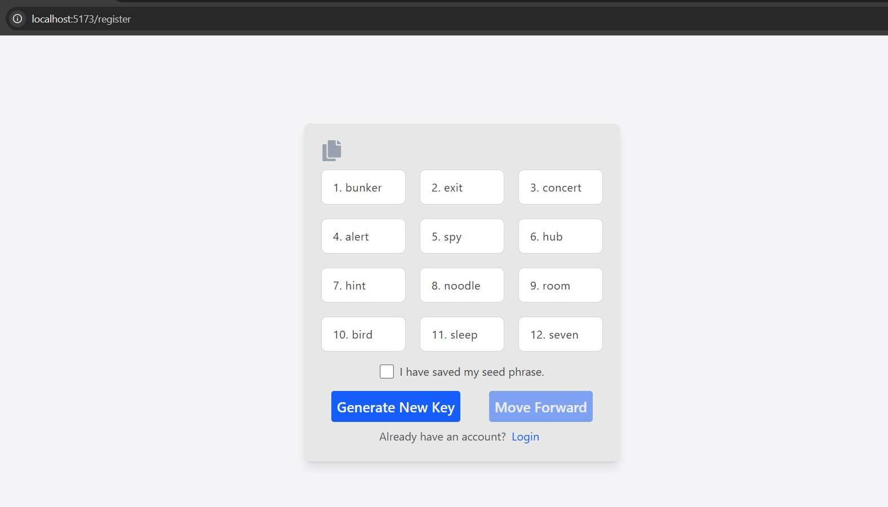
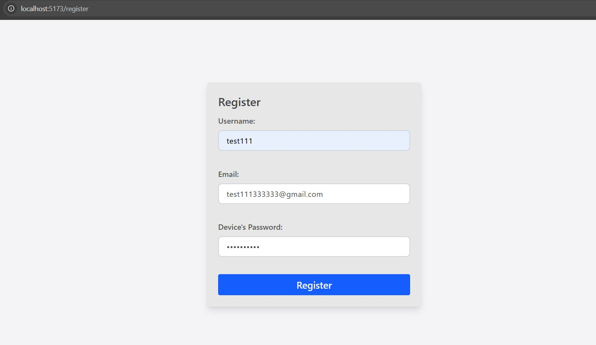

# SecureChat E2EE

A real-time, End-to-End Encrypted (E2EE) messaging platform on web, designed with a focus on cryptographic integrity and modern security practices.

## Demo

### Register

1. First 12 words Seed phrase is generated using [@scure/bip39](https://github.com/paulmillr/scure-bip39) library from [2048 English wordlists](https://github.com/paulmillr/scure-bip39/blob/main/src/wordlists/english.ts). 
2. 12 word mnemonics is converted to 64 length Unit8Array using `mnemonicToSeedWebCrypto`  function from same library which will be our master seed.

3. Once user clicks register, two private keys `encryption key` and `identity key` are generated from the masterseed utilizing `deriveBits` function from native `crypto` library using **HKDF (HMAC-based Key Derivation Function)** with **SHA-256** hashing algorithm.
4. Generated Private keys will be used to create two public keys `encryption public key` which will be utilized for encrypting messages and `identity public key` which will be utilized for verifying identity i.e. seed phrase.
    * **Identity public key**: This will be generated using [ED25519](https://github.com/paulmillr/noble-curves) elliptical curve.
    * **Encryption public key**: This will be generated using [curve25519](https://cryptography.io/en/latest/hazmat/primitives/asymmetric/x25519/) elliptical curve.
5. Password and a random 12 byte **salt** will be used to create storage key using [Aragon2id](https://www.npmjs.com/package/hash-wasm) hashing algorithm. Generated hash will be used to encrypt masterseed using **AES-GCM** algorithm from native `crypto` library.
6. `private and public keys` for device is generated using **ECDSA** with **P-256** curve.

7. User data like `username, email, identity public key, encryption public key, device name` will be sent to backend and if response is successful `encrypted master seed, device private (non-extractable) and public keys etc.` will be stored in indexedDB.

### Login

## Tech Stack

- **Frontend:** React, TypeScript, Tailwind CSS
- **Backend:** Node.js (Express), Socket.io, PostgreSQL, Redis
- **Cryptography:** `@noble/curves` (X25519/Ed25519), Web Crypto API (AES-GCM)
- **State:** React Context API + Custom Hooks

## References & Technical Research

### Standards & RFCs
* [Secure Messaging Apps and Group Protocols](https://blog.quarkslab.com/secure-messaging-apps-and-group-protocols-part-1.html) - Designing Simple DH based E2EE chat protocol.
* [Learning fast elliptic-curve cryptography](https://paulmillr.com/posts/noble-secp256k1-fast-ecc/) - Basic understanding of ECC
* [Password Storage Cheat Sheet](https://cheatsheetseries.owasp.org/cheatsheets/Password_Storage_Cheat_Sheet.html) - For secure Hashing algorithms research
* [Database Indexing Explained](https://computersciencesimplified.substack.com/p/database-indexing-explained)- Learning Database indexing

### Documentation & Tools
* [Web Crypto API (MDN)](https://developer.mozilla.org/en-US/docs/Web/API/Web_Crypto_API) - Native browser encryption.
* [Noble Curves](https://github.com/paulmillr/noble-curves) - High-security light-weight cryptographic JS library by Paul Miller.

---

## TODO
- [ ] **Settings:** Implement Settings to view devices and manage them, change username, password etc.
- [ ] **Multi-Device Sync:** Handling key distribution across multiple authorized devices.

---

## Possible Upgrades in Future
- Perfect Forward Secrity
- Device based jwt token, where we validate jwt is linked to device for each requireAuth requets (High computation cost, only for critical operations)
- Sign msg with identity so server can be sure msg is from correct user.